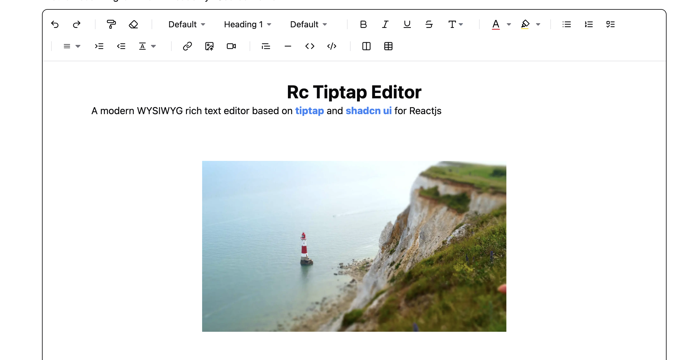

## Run Locally

Clone the project

```bash
git clone https://github.com/hunghg255/reactjs-tiptap-editor.git
```

Go to the project directory

```bash
cd reactjs-tiptap-editor
```

Install dependencies

```bash
pnpm install
```

Start the Demo server

```bash
npm run build:lib:dev
npm run playground
```
